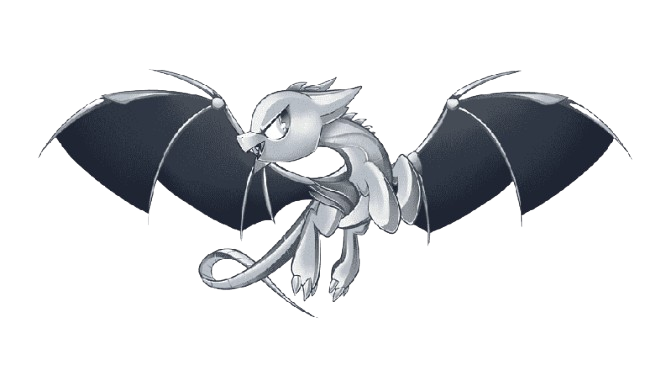

   

## Introduction

Obfussor is a powerful cross-platform application that transforms your C and C++ source code into reverse-engineering resistant binaries. Using advanced LLVM compiler infrastructure, it applies multiple obfuscation techniques to protect your intellectual property while maintaining optimal performance.

## Key Benefits

- **Robust Protection** - Multiple layers of obfuscation techniques
- **Zero Performance Loss** - Optimized transformations at IR level  
- **User-Friendly Interface** - Modern app with intuitive workflow
- **Detailed Analytics** - Comprehensive obfuscation reports
- **Cross-Platform** - Desktop and Mobile support

## Obfuscation Techniques

| Technique | Description | Impact |
|-----------|-------------|---------|
| **Control Flow Flattening** | Transforms program logic into complex, non-linear paths | High |
| **String Encryption** | Encrypts string literals with runtime decryption | Medium |
| **Dead Code Injection** | Inserts misleading code paths and dummy operations | High |
| **Instruction Substitution** | Replaces simple operations with complex equivalents | Medium |
| **Function Obfuscation** | Manipulates function boundaries and call patterns | Medium-High |

## Performance Metrics

Obfussor provides detailed analytics after each obfuscation:
- **Protection Coverage**: Percentage of code successfully obfuscated
- **Binary Size**: Before/after size comparison
- **Complexity Score**: Reverse engineering difficulty rating
- **Performance Impact**: Runtime overhead analysis

## Support

- **User Guide**: Built-in help system and tutorials
- **Issues**: [Report bugs or request features](https://github.com/matrixbytes/Obfussor/issues)
- **Community**: [Join discussions](https://github.com/matrixbytes/Obfussor/discussions)

## License

Released under the [MIT License](LICENSE). Free for personal and commercial use.